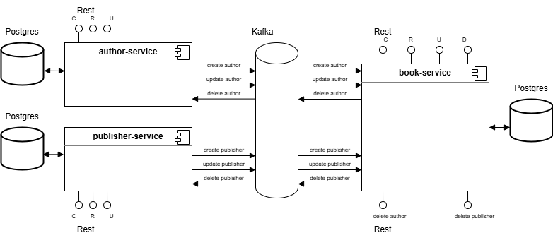

<h1>Книги</h1>

1. Project description
2. Architecture
3. Technologies
4. How to run
5. Services
6. Event flow
7. Database
8. Tests

## 1. Project description
Library System — микросервисная система для управления библиотекой.

Система состоит из нескольких сервисов:
- author-service
- publisher-service
- book-service

Сервисы взаимодействуют через Kafka.
Для хранения данных используется PostgreSQL.

## 2. Architecture

## 3. Technologies
Java 21  
Spring Boot 3  
Spring Data JPA  
Kafka  
PostgreSQL  
Flyway  
Docker  
Testcontainers  
JUnit 5

## 4. How to run
git clone https://github.com/username/library-system  
cd library-system  
docker compose up -d  
mvn clean install  

## 5. Services
author-service: http://localhost:8081  
publisher-service: http://localhost:8082  
book-service: http://localhost:8083  

_author-service_  
Обработка авторов книг. У одной книги может быть несколько авторов, а у одного автора - несколько книг.

Main entity:  
Author  
- id  
- name  

Events:
- AuthorCreatedEvent
- AuthorUpdatedEvent

_publisher-service_  
Обработка издателей книг. У одного издателя может быть несколько книг.

Main entity:  
Publisher  
- id  
- name  
- site  

Events:  
- PublisherCreatedEvent  
- PublisherUpdatedEvent  

_book-service_  
Обработка книг.

Таблицы:  
- book  
- author_cache  
- publisher_cache  

Events:  
- AuthorDeletedEvent  
- PublisherDeletedEvent  

Таблицы cache используются для исключения синхронных обращений к другим сервисам.

## 6. Event flow

Author created  
   |  
   v  
author-service  
   |  
   v  
Kafka topic: author-created  
   |  
   v  
book-service  
   |  
   v  
author_cache updated  

Publisher created  
   |  
   v  
publisher-service  
   |  
   v  
Kafka topic: publisher-created  
   |  
   v  
book-service  
   |  
   v  
publisher_cache updated  

Author deleted  
   |
   v
book-service
   |
   v
Kafka topic: author-deleted
   |
   v
author-service
   |
   v
author deleted

Publisher deleted
   |
   v
book-service
   |
   v
Kafka topic: publisher-deleted
   |
   v
publisher-service
   |
   v
publisher deleted

## 7. Database
Каждый микросервис использует собственную БД.  
author-service  
      └── library-author

publisher-service  
  └── library-publisher

book-service  
  └── library-book

## 8. Tests
В проекте используются интеграционные тесты с Testcontainers.
Kafka и PostgreSQL запускаются автоматически в Docker контейнерах.
